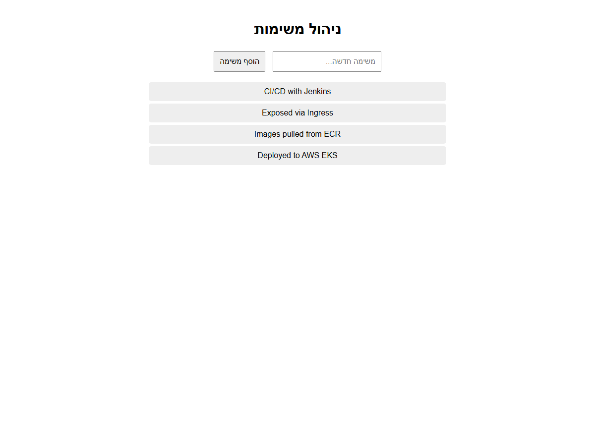
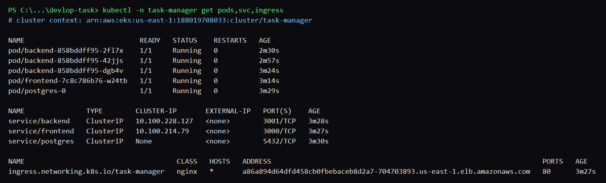
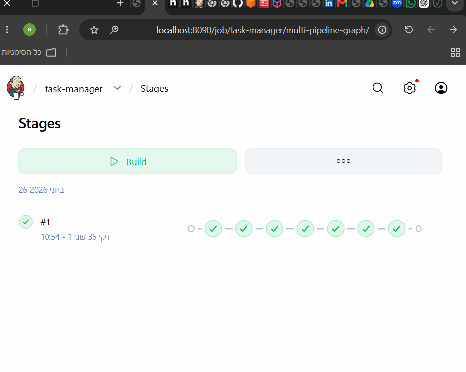

# DevOps Task Manager — EKS / ECR / Jenkins

A 3-tier task manager (React-less HTML **frontend**, Node/Express **backend**, **Postgres**)
deployed to **AWS EKS**, with images in **AWS ECR** and a **Jenkins** CI/CD pipeline.
This repo is the DevOps final project: everything is built to run for free on **minikube**
during development and on a short-lived, cost-minimized **EKS** cluster for the final demo.

> Submission checklist: app code · `Jenkinsfile` · `k8s/` manifests · this `README.md`
> with screenshots (app via Ingress, green pipeline, `kubectl get pods,svc,ingress`).

---

## Architecture

```
                      Internet
                         │
                 ┌───────▼────────┐   ONE LoadBalancer / Ingress (ingress-nginx)
                 │  Ingress        │
                 │  /     → frontend (3000)
                 │  /api  → backend  (3001)   ← browser calls ${BACKEND_URL}/api/tasks
                 └───┬─────────┬───┘
                     │         │
        ┌────────────▼──┐   ┌──▼──────────────┐
        │ frontend (1)  │   │ backend (3 pods) │  readiness=/health (SELECT 1)
        └───────────────┘   └──────┬───────────┘
                                   │ DB_HOST=postgres
                            ┌──────▼───────────┐
                            │ postgres (1)      │  StatefulSet + PVC (data persists)
                            └───────────────────┘
```

Only the **frontend** is exposed. The browser learns the backend address from the
frontend's `GET /config`, then calls it on the **same** Ingress host under `/api`, so the
backend needs no public hostname of its own and shares the single LoadBalancer.

---

## Requirements → how they are met

| Requirement                                | Where                                                                                                    |
| ------------------------------------------ | -------------------------------------------------------------------------------------------------------- |
| 3 backend pods, 1 frontend, 1 postgres     | `k8s/04`, `k8s/06`, `k8s/03` (`replicas`)                                                                |
| DB data survives pod restart               | `k8s/03` StatefulSet + `volumeClaimTemplates` (PVC)                                                      |
| No plaintext passwords/URLs in Deployments | `k8s/01-secret.yaml` (base64) + `k8s/02-configmap.yaml`, referenced via `secretKeyRef`/`configMapKeyRef` |
| Backend → NotReady when DB down            | `k8s/04` `readinessProbe: GET /health` (returns 503 if DB unreachable)                                   |
| Expose only frontend via Ingress           | `k8s/08-ingress.yaml` (`/`→frontend, `/api`→backend, single host)                                        |
| Zero-downtime upgrades                     | RollingUpdate `maxUnavailable:0, maxSurge:1` + readiness gating                                          |
| Versioned images, never overwritten        | `Jenkinsfile` tags `v${BUILD_NUMBER}` and pushes to ECR                                                  |

---

## Repo layout

```
backend/  frontend/  docker-compose.yml      # app (used for the local prep step)
k8s/                 # all Kubernetes manifests (00..08)
eks/                 # eksctl cluster config + gp3 StorageClass
scripts/             # ecr-create / build-push / minikube-up / eks-up / eks-down
jenkins/             # local Jenkins (Dockerfile + compose) + webhook guide
Jenkinsfile          # CI/CD pipeline
docs/screenshots/    # put the required screenshots here
```

---

## Prerequisites

`docker`, `kubectl`, `helm`, `minikube` (local), and `aws` CLI + `eksctl` (cloud).
Configure AWS once: `aws configure` (region `us-east-1`).

---

## 0) Run locally (prep step)

```bash
docker compose up --build      # app at http://localhost:3000
```

## 1) Develop & test FREE on minikube

```bash
./scripts/minikube-up.sh       # builds images into minikube, applies k8s/, sets BACKEND_URL
kubectl -n task-manager get pods,svc,ingress
```

## 2) ECR (Part A)

```bash
./scripts/ecr-create.sh        # creates the two repos
./scripts/build-push.sh v1     # optional: verify a manual push works
```

## 3) EKS (Part B+C) — short, cost-minimized session

```bash
./scripts/eks-up.sh            # create cluster, ingress-nginx, deploy app, print app URL
```

## 4) CI/CD with Jenkins (local + ngrok)

See **`jenkins/README-jenkins.md`**. Summary: run Jenkins in Docker, add `aws-credentials`,
create a Pipeline-from-SCM job pointing at `Jenkinsfile`, expose with `ngrok http 8090`,
and add a GitHub push webhook to `https://<ngrok>/github-webhook/`. Each push →
build `v${BUILD_NUMBER}` → push to ECR → roll out to EKS with no downtime.

## 5) TEAR DOWN (stop the bill!)

Only after the pipeline has run at least once (green) and all screenshots are captured:

```bash
./scripts/eks-down.sh          # deletes cluster + LB; lists any orphaned LB/EBS to clean
```

---

## Verification commands

```bash
# 3 backend pods Ready
kubectl -n task-manager get pods

# DB persistence: delete the postgres pod, then confirm old tasks remain after it restarts
kubectl -n task-manager delete pod postgres-0

# Backend becomes NotReady when DB is gone, recovers when it returns
kubectl -n task-manager scale statefulset/postgres --replicas=0   # watch backend READY 0/1
kubectl -n task-manager scale statefulset/postgres --replicas=1

# Only frontend exposed
kubectl -n task-manager get ingress

# Zero-downtime rollout
kubectl -n task-manager set image deployment/backend backend=<ECR>/task-manager-backend:vN
kubectl -n task-manager rollout status deployment/backend
```

---

## Cost notes (no free tier)

Everything heavy runs on free minikube; EKS exists only for one short demo session.

| Item                       | Approach                         | Cost      |
| -------------------------- | -------------------------------- | --------- |
| Dev / Jenkins              | minikube + local Jenkins + ngrok | $0        |
| ECR                        | 2 small images                   | ~cents/mo |
| EKS control plane          | $0.10/hr × ~4 hr                 | ~$0.40    |
| 2× t3.small **spot** nodes | ~4 hr                            | ~$0.06    |
| Ingress LoadBalancer       | ~4 hr                            | ~$0.10    |
| **NAT gateway**            | **disabled** (public subnets)    | **$0**    |
| **Total**                  | one session                      | **~$1–2** |

Rules: never leave EKS overnight; always `./scripts/eks-down.sh`; spot nodes; single AZ;
no NAT gateway; `us-east-1`.

---

## Screenshots (required)

### App running via Ingress

The browser loads the frontend through the Ingress; the task list is fetched from the
backend via the `/api` path on the same Ingress host.



### kubectl get pods,svc,ingress

3 backend pods, 1 frontend, 1 postgres (StatefulSet); ClusterIP services (postgres
headless); a single nginx Ingress.



### Jenkins pipeline — green

Triggered automatically by a GitHub push webhook (via ngrok). All stages pass: checkout,
resolve AWS/ECR, ECR login, build & push the versioned images, and roll out to EKS.


